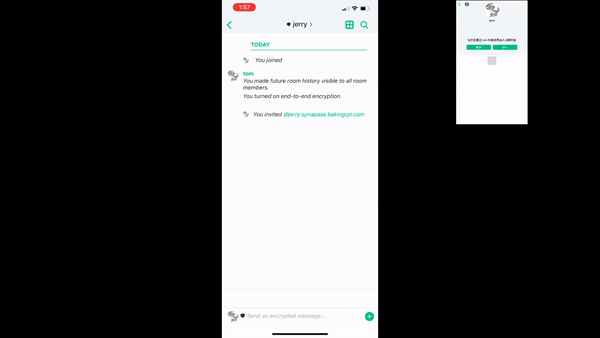

# Raspberry Pi Instant Message Server

[Matrix](https://matrix.org/) is an open-source project that publishes the Matrix open standard for secure, decentralized, real-time communication. Deploy the matrix cloud server requires the user familiar with the Operation System and good skill of the command lines. This repository is intended to simplify the installation to one command line. 

The script is tested working on Raspberry Pi 4 with Raspberry PI OS(32-bit Released: 2020-05-27).  if you have any issue using this script, please submit a bug report to help us improve the code. 


More Tutorials. please visit us:  [Baking Raspberry Pi](https://www.youtube.com/channel/UCFBHlyED8_VZ2yfLXoAXrbg). 

[](https://www.youtube.com/watch?v=_3i5tZ3SxSs "")


## Demo

### 1. Send message


### 2. voice call


### 3. video Call


## Usage
### Step 1. Pre-request 

Before you install the Matrix server, you need to set your domain correctly in the [config.cfg](config.cfg). Replace ['example.com']() with your own domain name.

```
# Your own domain
# required
myDomain=example.com # Your own domain, required

```

### Step 2. Forward port
If your Raspberr Pi is under a router, you may need to set the port forwarding in your router. We also have a toturial you can refer to. [\[Click to Open toturial\]](https://www.google.com/search?q=router+port+forwarding&oq=router+por) 

You need to forward all the 443 port to your Raspberry Pi 443 port.

### Step 3. Deploy

```
sudo bash imEasyServer.sh
```
In this step, the script will do the following things:

*  Installing prerequisites
*  Installing Synapse home server
*  Configuring Synapse
*  Install and Enabling TLS
*  Configuring reverse proxy with nginx
*  Check web connection to confirm install successfully


## Known issue

### 1. ufw firewall issue
if enable the SSH or VNC before install ufw package, the ufw can not be enabled. If the user need SSH or VNC, need to install ufw first 
```
sudo apt install ufw -y

sudo ufw enable 
sudu ufw allow 22     # SSH 
sudo ufw allow 5900   # VNC
```

### 2. sometimes the emojis can not display correctly on terminal
